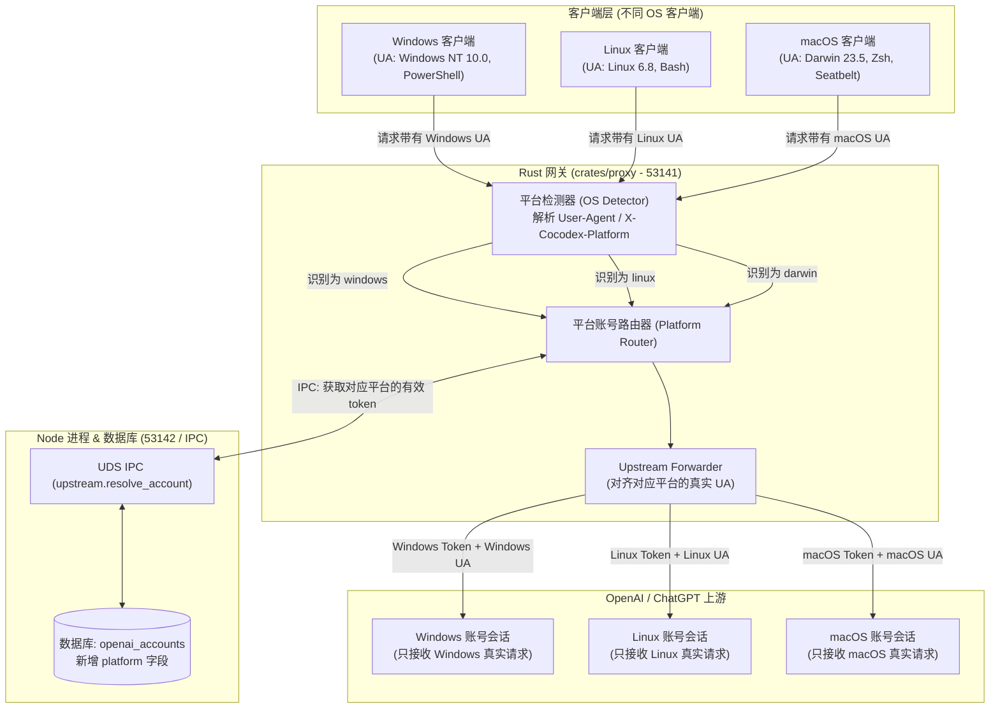

# 多操作系统（Windows / Linux / macOS）上游账号独立隔离与路由实现方案

## 方案背景与目标

为了彻底避免由于跨操作系统（例如同一账号同时在 Windows 和 macOS 上交替运行，或者 User-Agent 与 Prompt 中的工具描述、路径风格不匹配）导致 OpenAI 上游的风控关联与封禁风险，同时保证模型推理不受伪造数据的干扰，我们设计**平台级上游账号多路隔离方案**：

1. **上游独立登录（3 个账号分别绑定 3 个系统的真实 UA）**：
   - **Windows 账号**：登录与刷新全程使用 Windows 真实 UA（如 `codex_cli_rs/0.154.0 (Windows_NT 10.0.22631; x86_64) WindowsTerminal`）；
   - **Linux 账号**：登录与刷新全程使用 Linux 真实 UA（如 `codex_cli_rs/0.154.0 (Linux 6.8.0; x86_64) unknown`）；
   - **macOS 账号**：登录与刷新全程使用 macOS 真实 UA（如 `codex_cli_rs/0.154.0 (Darwin 23.5.0; arm64) Apple_Terminal`）。
2. **网关智能检测与分发路由**：
   - 客户端（Codex CLI 或 IDE）向 Rust 代理（`crates/proxy`）发起推理或会话请求时，代理自动分析传入请求的 `User-Agent`（或指定平台标头）；
   - 自动路由绑定到对应平台的活跃上游账号；
   - 保持客户端工具定义（如 Windows 的 `windows_shell_guidance`、路径风格）与上游账号完全匹配，100% 还原真实原生环境，对模型推理与工具调用零干扰。

---

## 用户需知事项 (User Review Required)

> [!IMPORTANT]
> 1. **数据库改动**：`openai_accounts` 表将新增 `platform` 字段（类型 `varchar(32)`，可选值：`'windows'`, `'linux'`, `'darwin'`, `'all'`，默认 `'all'`）。已有历史账号将自动归为 `'all'` 或 `'linux'`。
> 2. **上游登录操作**：在 Web 管理后台（或通过命令行接口）进行上游 Device Auth 登录时，将提供一个系统平台选择（Windows / Linux / macOS）。登录时将使用对应平台的真实 User-Agent 向 OpenAI 请求验证码与 Token，换取后打上对应平台标签入库。
> 3. **降级策略 (Fallback)**：若某个操作系统（如 macOS）尚未配置对应专属账号，可配置回退规则（如使用标记为 `'all'` 的通用账号，或报错提示未配置该平台的上游账号）。

---

## 详细实施计划

### 1. 数据库与数据模型适配 (Database Schema)

- **表结构变更**：
  在 `openai_accounts` 中添加字段 `platform VARCHAR(32) NOT NULL DEFAULT 'all'`。
- **文件改动**：
  - `src/database/internal/accounts/shared.ts`：更新 `OpenAIAccountRow` 和 `OpenAIAccountRecord` 增加 `platform` 属性。
  - `src/database/internal/accounts/upsert.ts`：支持写入和更新 `platform`。
  - `src/database/internal/accounts/active.ts`：提供根据 `platform` 查询活跃上游账号的查询方法（优先取对应平台，次选 `'all'`）。

### 2. Node 上游认证与 User-Agent 体系 (OpenAI Auth & Identity)

- **预定义三大平台真实 User-Agent 模版**（位于 `src/openai-api/internal/client-identity.ts`）：
  - `windows`: `codex_cli_rs/0.154.0 (Windows_NT 10.0.22631; x86_64) WindowsTerminal`
  - `linux`: `codex_cli_rs/0.154.0 (Linux 6.8.0; x86_64) unknown`
  - `darwin`: `codex_cli_rs/0.154.0 (Darwin 23.5.0; arm64) Apple_Terminal`
- **Device Auth 登录接口支持传参**（`src/server/routes/admin/admin-routes.ts`）：
  - `/api/openai-accounts/device-auth/start` 接收 `{ platform?: "windows" | "linux" | "darwin" }`。
  - 启动认证与轮询 Token 时，使用选定平台的 User-Agent 发送请求。
  - 入库时自动记录对应的 `platform`。
- **Token 自动刷新服务**：
  - `upstream-request-services.ts` 刷新 Token 时，读取该账号记录的 `platform` 并使用对应的 User-Agent，防止刷新时 UA 变异。

### 3. UDS 进程间通信扩展 (IPC Protocol)

- **Node IPC 服务端** (`src/server/ipc/uds-server.ts`)：
  - 新增 RPC 方法 `upstream.resolve_account`：
    - 参数：`{ platform: "windows" | "linux" | "darwin" }`
    - 返回：`{ accountId: string, accessToken: string, platform: string, userAgent: string }`
- **Rust IPC 客户端** (`crates/proxy/src/ipc/protocol.rs` & `client.rs`)：
  - 定义 `ResolveUpstreamAccountParams` 和 `ResolveUpstreamAccountResult` 结构体。
  - 提供 `resolve_upstream_account(platform: &str)` 接口供代理拦截器调用。

### 4. Rust 网关流量拦截与分发 (crates/proxy)

- **平台检测模块** (`crates/proxy/src/interceptor/platform.rs` [新文件])：
  - 检测输入优先级：
    1. 显式请求头：`X-Cocodex-Platform`（值：`windows`, `linux`, `darwin`）
    2. 客户端 `User-Agent`：正则匹配 `windows` / `linux` / `darwin|macintosh|mac os`
    3. 默认兜底：`linux`
- **代理转发与 Token 替换** (`crates/proxy/src/interceptor/custom.rs` & `forwarder.rs`)：
  - 针对进入的 `/backend-api/*` 和 WebSocket `/backend-api/codex/responses` 请求：
    1. 通过 `detect_platform(&req)` 判定客户端来源平台；
    2. 调用 IPC 获取对应平台的上游账号 Token 及平台规范 UA；
    3. 将 `ctx.upstream_token` 设置为该账号的 `access_token`；
    4. 将发送往 OpenAI 的 `User-Agent` 规范化为该平台的标准真实 UA；
    5. 保留客户端原生提供的全部功能参数（Prompt、`windows_shell_guidance`、Tool Schema），确保模型与真实客户端无缝协同。

---

## 验证与测试计划

1. **平台检测单元测试**：
   - 测试 Windows、Linux、macOS Codex CLI 的 User-Agent 字符串能否准确解析为 `windows`、`linux`、`darwin`。
2. **IPC 账号解析测试**：
   - 针对不同 platform 请求，验证 Node IPC 是否正确返回打了该平台 tag 的账号 Token。
3. **模拟端到端转发验证**：
   - 构造携带 Windows UA 的请求，验证代理是否注入了 Windows 上游账号的 Token 并将上游请求 UA 对齐；
   - 构造携带 Linux UA 的请求，验证代理是否路由到了 Linux 上游账号。
